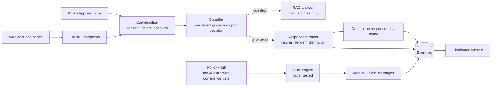

# Praman

**Praman stops avoidable claim rejections before they happen, and sends every question to the party that actually owes the answer.**

*Praman* (प्रमाण) means proof. It is an assistant for Indian policyholders and borrowers, used over WhatsApp or the web, in their own language. Before she files a health insurance claim, it tells her whether the claim will be stopped and, if not, how much will be cut and why. When something has already gone wrong, it works out who owes her the answer (the insurer, the lender or the distributor) and drafts the letter to them by name.

> Prototype built for a hackathon demo. All data in this repository is labelled example data. Nothing here is filed or sent anywhere.

---

## The hackathon

| | |
|---|---|
| Event | Paytm Build for India hackathon, Mumbai edition |
| Track | AI-Powered Financial Journeys |
| Team | Hack_Overflow |
| Build window | 8 hours |
| Deliverable | One live demo, one repo, one video or deck |

The build plan is [`PRD-PAYTM.md`](PRD-PAYTM.md). It describes each change (C1–C7) and each new feature (N1–N9) referenced below.

### The problem

A health claim is usually rejected or cut for reasons that could have been seen in advance:
- The treatment is still inside a waiting period.
- The procedure is excluded.
- The room costs more than the policy's room-rent limit, so part of the bill is cut in proportion.
- Documents are missing.

The policyholder rarely finds out until after she has paid and filed.

A distributor sits in the middle. The customer paid the distributor, so she asks the distributor, even when the insurer or the lender owns the answer. The distributor's support desk becomes a relay, chasing the insurer on her behalf. Every case sent straight to the party that owes the answer is a ticket the distributor never has to handle.

### How Praman answers the track

- **Stops avoidable rejections before they happen.**
  - A tested rule engine checks the claim against her policy and bill before she files.
  - The answer is one of three: file; do not file yet (with the date it becomes possible); or file with a known deduction (with the amount).
- **Sends every question to the right party.**
  - A pure router maps each situation to the insurer, the lender or the distributor, with that party's own escalation ladder and clock.
  - The distributor sees only what is genuinely its own.
- **Shows the distributor its own benefit.**
  - A console counts, from recorded events only, how many cases needed the distributor and how many went straight to the insurer or lender.
  - Nothing is projected. "What would this save?" is answered by multiplying that count by the distributor's own cost per ticket.

What Praman does not do: recommend a policy or a lender, predict approval, score credit, or file anything automatically.

---

## The demo (PRD-PAYTM Part 9)

Three minutes, one phone, in Marathi:

1. **Claim readiness.** Her father is about to be admitted. She sends photos of the policy and the hospital bill. Praman replies by voice:
   - the room she was quoted is above her policy's limit;
   - about ₹35,625 will be cut from room, doctor and surgery charges;
   - medicines, tests and implants are not cut;
   - a room within the limit means nothing is cut.

   (Figures are from the example documents in this repo.)
2. **Checklist.** She sends document photos one at a time. Each ticks off a slot, and Praman says, by name, which are still missing.
3. **Leverage.** A second case: a claim rejected for non-disclosure on a policy held for six years.
   - Praman explains the moratorium rule: after five years of continuous cover, a claim cannot be rejected for non-disclosure unless fraud is proved.
   - It reads back a draft to the insurer, addressed by name. She approves it, and the screen says **Approved and ready to send**.
4. **The distributor's view.** The console shows both cases routed to the insurer, a double-debit case under the distributor, and the headline "Of N cases, X needed the distributor".
5. **Delete everything.** She types "delete everything" and the case disappears from the console.

`backend/scripts/reset_demo.py` seeds exactly these example cases in about a second.

---

## How it works



### Principles the code enforces

- **The refusal is a tested function, not a model's opinion.**
  - The rule engine (`backend/app/core/ladder_engine.py`) is pure: no network, no LLM, no randomness, no clock. A test reads its source to prove it.
  - All money and date arithmetic lives there, including the room-cap deduction to the rupee.
  - Every rule has a blocked, a clear and a missing-fact test.
- **A missing fact is never a "no".** Facts default to "not known". A missing fact holds the verdict and becomes a question to her; it never becomes the permissive answer.
- **Nothing is assumed from a document.**
  - Every extracted field carries a confidence, and anything below the gate is asked, not used.
  - A number the model reports that isn't in the document's own text is distrusted.
  - A bill line that can't be placed as "cut" or "never cut" is asked, not guessed.
- **Legal content is verified or badged.**
  - Every rule, regulatory limit and response window carries `verified_by`. Until a named person checks it against the source, it stays `UNVERIFIED`, and anything shown to her that rests on it carries a "Not yet verified" badge.
  - `python backend/scripts/verify_report.py` lists each one with its file and line.
- **Answers come from sources or not at all.**
  - Coverage questions are answered only from her own insurer's documents for her product, or from regulation, with a citation such as `[Example General Insurance, policy_wording, p.2]`.
  - An answer without a valid citation becomes "no source", and the question is handed to the insurer as a written coverage query.
  - Answers never promise approval, and never write to the rule engine's facts.
- **Nothing is filed.** Praman drafts; she approves. An approved letter is "approved and ready to send". Sending is a partner integration, not something this prototype claims.
- **Privacy by default.**
  - Consent is asked in her language before any document is read.
  - Only the extracted fields are kept, not the file, unless she asks.
  - Aadhaar, PAN, account and policy numbers are masked in every piece of text sent out for AI processing.
  - "Delete everything" deletes the case, its documents, letters and events, including from the console.
- **No invented numbers.** No rejection rates, savings or adoption figures anywhere. Every console number is counted from event rows, and example data is always labelled as an example.

### What is built

| PRD item | What it does | Where |
|---|---|---|
| C1 | Classifier: grievance, question or pre-decision; lending, insurance and platform classes; product | `backend/app/core/agent.py` |
| C2, C4 | Fact sheet, verdict, six rule kinds, required facts per rule | `backend/app/core/ladder_engine.py` |
| C3, N2 | Extraction for policy, bill, letter and loan key fact statement; detecting the document type; confidence gate | `backend/app/services/documents.py` |
| C5 | `verified_by` everywhere, the verification report, badges in every reply | `backend/scripts/verify_report.py` |
| C6 | "Approved and ready to send", never "filed"; enforced by a test | `backend/tests/test_wording.py` |
| C7 | SQLite store: cases, documents, consents, events, drafts | `backend/app/store.py` |
| N1 | Health-claim readiness ladder: waiting period, exclusion, lapse, room cap, documents, PED cap, moratorium | `backend/data/ladders/insurance_health_claim.yaml` |
| N3 | Document checklist over WhatsApp: photos tick slots, with a numbered-list fallback | `backend/app/cases.py`, `backend/app/channels/whatsapp.py` |
| N5 | Respondent router with per-respondent ladders and clocks | `backend/app/core/routing.py` |
| N6 | Consent, redaction, delete everything | `backend/app/conversation.py`, `backend/app/services/redact.py` |
| N8 | Distributor console: headline, six counters, case list | `backend/app/console.py`, `frontend/app/console` |
| Coverage Q&A | Answers with citations for questions, in her language | `backend/app/rag/` |
| Web | Demo site: chat with voice, policies, readiness, checklist, case, console | `frontend/` |

Not built yet, and presented as next steps:
- the lending "fair offer" ruleset (N4; the key-fact-statement extraction schema exists);
- the motor ruleset (N9);
- claim and loan deadline reminders (N7).

### Stack

- **Backend:** Python 3.11 and FastAPI, with SQLite for storage.
- **AI:** Sarvam for everything:
  - chat and classification;
  - Doc AI to read documents;
  - speech-to-text and text-to-speech;
  - translation and language detection.
- **Coverage questions:** ChromaDB for search, with local MiniLM embeddings or an offline hashing fallback, and PyMuPDF to read PDFs.
- **WhatsApp:** Twilio.
- **Frontend:** Next.js 16 (App Router), TypeScript and Tailwind CSS v4.

---

## Repository layout

```
backend/
  app/
    core/         rule engine, ladders loader, respondent router, classifier (pure where it matters)
    services/     document extraction, drafts, redaction, voice, translation, block normaliser
    channels/     WhatsApp (Twilio)
    rag/          ingest, retrieve, answer, eval for coverage questions
    conversation.py, cases.py, readiness.py, console.py, store.py, main.py
  data/
    ladders/      health-claim ladder and escalation steps (every value carries verified_by)
    checklists/   documents a health claim needs
    corpus/       documents the assistant may answer from, listed in sources.yaml
    eval/         golden questions for the RAG eval
    bill_heads.yaml
  scripts/        seed_demo.py, reset_demo.py, verify_report.py
  tests/          662 tests, no network
frontend/         Next.js demo site
PRD-PAYTM.md      the hackathon build plan
CLAUDE.md         standing rules and module map for contributors
```

---

## Running it

### Backend

Run everything from `backend/`.

```sh
cd backend
python -m venv .venv
# Windows (PowerShell): .venv\Scripts\Activate.ps1
# macOS / Linux:        source .venv/bin/activate
pip install -r requirements-dev.txt
cp .env.example .env                         # then set SARVAM_API_KEY

uvicorn app.main:app --reload --port 8000   # http://localhost:8000/health
python -m pytest                             # run the test suite (no network, Sarvam is faked)
```

`GET /api/health` reports what is configured (503 until `SARVAM_API_KEY` is set) without echoing secrets.

Legal and regulatory values are marked `UNVERIFIED` until someone checks them by hand. To list each one with its file, line and source:

```sh
python scripts/verify_report.py            # add --strict to fail while any remain
```

### Frontend

Start the backend first, then from `frontend/`:

```sh
cd frontend
npm install
cp .env.example .env.local   # NEXT_PUBLIC_API_BASE_URL=http://localhost:8000
npm run dev                  # http://localhost:3000
```

The backend accepts browser calls only from `CORS_ORIGINS` (default `http://localhost:3000`). Pages and endpoints are listed in `frontend/README.md`.

### Running the demo

Two terminals:

```sh
# 1. backend/
python scripts/reset_demo.py                 # wipe the demo store, seed the Part 9 example cases, print the headline
uvicorn app.main:app --reload --port 8000

# 2. frontend/
npm run dev
```

Between rehearsals, run `python scripts/reset_demo.py` again (about a second; the server can keep running). It deletes every case in the store, including ones made live. To add the example cases without wiping, use `python scripts/seed_demo.py`.

In `backend/.env`:
- `DISTRIBUTOR_SHORT_NAME` sets how the console headline names the distributor.
- `DISTRIBUTOR_LEGAL_NAME` sets who drafts to the distributor are addressed to.

Without `SARVAM_API_KEY`, the chat can't understand messages or answer questions, so it replies with the document checklist. Documents can still be checked with "Use demo files".

### Coverage questions (RAG)

The dependencies are in `requirements.txt`:
- `pymupdf` reads PDFs page by page.
- `chromadb` keeps the index in `backend/data/index` (git-ignored).

The default embeddings (MiniLM, via Chroma) download about 80 MB once, on first ingest. Set `RAG_EMBEDDINGS=hashing` for an offline index with no download.

1. Put documents under `backend/data/corpus/` (`regulation/`, `insurer/<insurer>/<product>/`, `paytm/`), and list each one in `backend/data/corpus/sources.yaml`.
2. Build or refresh the index (only changed files are re-read):

```sh
python -m app.rag.ingest
```

3. Score answers against `backend/data/eval/golden.yaml` (needs the index and `SARVAM_API_KEY`):

```sh
python -m app.rag.eval
```

The corpus ships with one example policy wording, labelled as an example, so the eval runs out of the box. Replace it with real documents.

### WhatsApp (Twilio sandbox)

1. Expose the backend: `ngrok http 8000`, and put the https URL in `.env` as `PUBLIC_BASE_URL`.
2. In `.env`, set `TWILIO_ACCOUNT_SID`, `TWILIO_AUTH_TOKEN` and `TWILIO_WHATSAPP_FROM` (the sandbox number, `whatsapp:+14155238886`).
3. In the Twilio console's WhatsApp sandbox settings, set "When a message comes in" to `<PUBLIC_BASE_URL>/api/whatsapp/webhook` (POST).
4. Join the sandbox from the demo phone, then send a document photo. The reply lists what is still missing, as text and as a voice note in her language.

With `TWILIO_AUTH_TOKEN` set, the webhook refuses requests without a valid Twilio signature. `PUBLIC_BASE_URL` must be the exact URL Twilio calls, or every signature check fails.

---

## Status and known limits

- **Legal values are unverified.**
  - Every rule, the 36-month pre-existing disease cap, the 60-month moratorium, the room-cap exemptions and the grievance response windows are marked `UNVERIFIED`.
  - They need checking against the IRDAI and RBI primary sources before being relied on. The verification report lists them.
- **Live AI paths need a Sarvam key.** The tests fake Sarvam. The following need a real key to exercise end to end:
  - classification;
  - cited answers to coverage questions;
  - voice replies;
  - speech-to-text on browser recordings.
- **Photos go to Sarvam Doc AI to be read.** Her consent covers this, and the prompt says so. Text sent out is masked, but images cannot be.
- **Some state is held in memory only:** voice notes, and photos waiting for her consent. A server restart drops them.
- **No authentication.** The console and case pages are open, as a demo. They show company names, never her number or name.
- **One example document.** The coverage-question corpus ships with one example policy wording; real insurer wordings and regulations still need adding.

---

## Prior work disclosure

Praman began as an earlier project for analysing loan documents. That project's shared infrastructure was ported into this repository at the start of the build:
- the Sarvam client;
- the Doc AI page-splitting and extraction pipeline;
- the block normaliser;
- the translation cache.

Everything specific to this track was built for this hackathon, and is described in `PRD-PAYTM.md`:
- the rule engine and health-claim ladder;
- document extraction for policies and bills;
- the checklist;
- the respondent router;
- consent, redaction and delete;
- the distributor console;
- coverage questions with citations;
- the demo web front end.

Praman is not affiliated with or endorsed by any insurer, lender or distributor named in the build plan.
